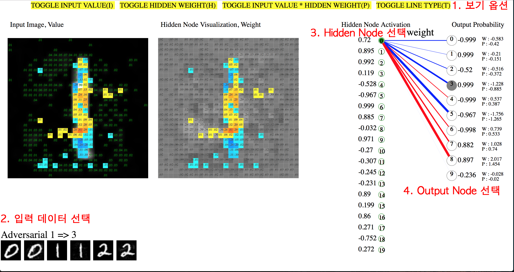

#Adversarial MNIST Weight Visualization

### 실험 목표
Adversarial MNIST 데이터와 정상적인 MNIST 데이터가 입력되었을 때 Input Value Hidden Node의 Weight 값, Output Node의 Weight 값을 Visualize하여 확인하고자 함.

### 실험 내용
- 20개의 Hidden Node, 10개의 Output Node, 1개의 Hidden Layer를 가진 MLP 모델을 구성함.
- Adversarial 데이터가 없는 MNIST 데이터로 모델을 학습함.
- 학습된 모델의 Weight 값을 추출하여, Visualization.
- 각 입력 데이터의 값(가장 좌측의 이미지)와 각 Hidden Node의 값(가운데 이미지), 각 노드가 미치는 영향(우측 빨간색,파란색 선)을 확인할 수 있음.

### 설치
`gem install sinatra`

`ruby app.rb`

`http://localhost:4567` 접속

### 사용법

##### 1. 보기 옵션

`TOGGLE INPUT VALUE(I)` 하단의 'Input Image, Value'의 이미지에 입력 값이 출력됨. 이때, 0은 표시 되지 않음.

`TOGGLE HIDDEN WEIGHT(I)` 하단의 'Hidden Node Visualization, Weight'의 이미지에 Weight 값이 출력됨. 이때, 0은 표시되지 않음.
 
`TOGGLE INPUT VALUE * HIDDEN WEIGHT(P)` 하단의 이미지들에 Input Value와 Hidden Node의 Weight를 곱한 값을 표시함.
양의 값은 노란색에서 빨간색으로 표시되며, 양의 값은 하늘색에서 짙은 파란색으로 표시됩니다. 진할 수록 절대 값이 높음.

`TOGGLE LINE TYPE(T)` 우측 하단의 Hidden Node Activation과 Output Probability를 연결하는 선이 나타내는 값을 weight 또는 product sum로 변경함.

##### 2. 입력 데이터 선택
6개의 이미지 중 원하는 이미지를 입력할 수 있습니다. 홀수번째 이미지는 정상 입력값, 짝수번째 이미지는 Adversarial 입력값임..

##### 3. Hidden Node 선택
초록색 외곽선을 가진 원을 선택하여 Hidden Node를 바꿀 수 있음.

노드를 바꾸면 좌측의 이미지와 우측의 선이 바뀌게 됨.

##### 4. Output Node 선택
회색 외곽선을 가진 원을 선택하여 Output Node를 바꿀 수 있음.
